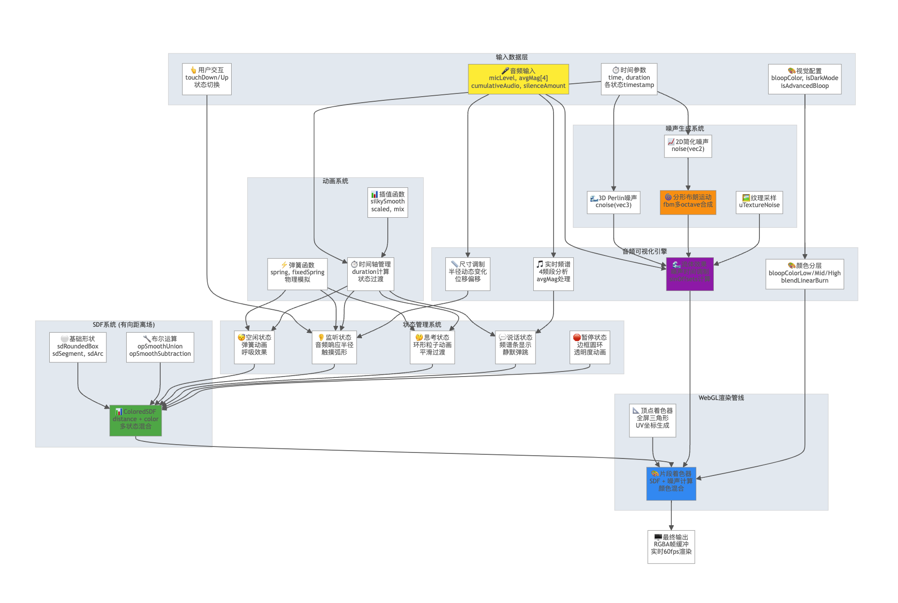

# 🌊 云韵音律 (CloudWave Audio Visualizer)

一个基于WebGL的实时音频可视化系统，通过动态的云雾和粒子效果将声音转化为美丽的视觉艺术。

## ✨ 项目特色

### 🎵 多种视觉效果
- **蓝天云雾动画** - 如梦似幻的云雾在天空中流动，随音频强度变化
- **OpenAI风格动效** - 专业级的多状态动画系统，包含听、说、思考等状态
- **实时音频响应** - 支持麦克风输入，音频强度实时驱动视觉效果

### 🛠 技术亮点
- **WebGL 2.0渲染** - 高性能GPU加速渲染
- **SDF有向距离场** - 创建平滑的几何形状和动画
- **3D噪声算法** - 使用Perlin噪声和分形布朗运动
- **多频段音频分析** - 低频、中频、高频独立处理
- **物理模拟动画** - 弹簧函数和流体动力学

## 🎮 功能演示

### 📹 效果演示视频

<video width="100%" controls autoplay muted loop>
  <source src="demo.mov" type="video/quicktime">
  <source src="https://github.com/acupofespresso/CloudWave/raw/main/demo.mov" type="video/quicktime">
  您的浏览器不支持视频标签。<br>
  <a href="demo.mov">点击这里下载观看演示视频</a>
</video>

> 📺 观看完整的实时音频可视化效果演示，展示云雾动画、音频响应和多种状态切换的动态效果。

### 基础云雾效果 (`webgl.html`)
- 🌤️ 蓝天云雾动画，圆形视窗展示
- 🎤 支持麦克风音频输入
- 💨 呼吸效果，画布随音频强度变化
- 🌊 流体变形，多层次云雾渲染
- 📊 实时音频频谱分析

### 增强云雾效果 (`webgl_plus.html`)
- 与基础版本相同的功能
- 优化的渲染性能
- 改进的音频响应算法

### OpenAI风格动效 (`webgl_wave_openai.html` + `openai.js`)
- 🤖 **完整状态机系统**：
  - **applyIdleState** - 空闲状态，弹簧动画和自然呼吸
  - **applyListenState** - 监听状态，音频响应半径、触摸弧形
  - **applyThinkState** - 思考状态，环形粒子系统
  - **applySpeakState** - 说话状态，频谱条和静默弹跳
  - **applyHaltState** - 暂停状态，透明度动画边框
- 🔧 **SDF几何引擎**：
  - 有向距离场(SDF)实时计算
  - 布尔运算(Union/Subtraction/Intersection)
  - 平滑混合和形状变形
- 🎨 **专业渲染管线**：
  - WebGL 2.0 + GLSL ES 3.0着色器
  - 统一缓冲对象(UBO)数据传输
  - 多层混合模式和颜色空间
- 🌊 **高级音频可视化**：
  - 4频段实时频谱分析
  - 噪声纹理和流体模拟
  - 物理弹簧动画系统

## 🚀 快速开始

### 环境要求
- 现代浏览器（支持WebGL 2.0）
- 麦克风权限（用于音频输入）
- 本地服务器或HTTPS环境

### 运行方式

1. **直接访问**
   ```bash
   # 使用任意本地服务器
   python -m http.server 8000
   # 或
   npx serve .
   ```

2. **访问演示**
   - 基础云雾: `http://localhost:8000/webgl.html`
   - 增强云雾: `http://localhost:8000/webgl_plus.html`
   - OpenAI风格: `http://localhost:8000/webgl_wave_openai.html`

3. **授权麦克风**
   - 浏览器会请求麦克风权限
   - 允许后即可体验音频响应效果
   - 如无麦克风，系统会使用模拟音频数据

## 🎛️ 控制面板

### OpenAI风格版本提供丰富的控制选项：
- **状态切换** - 手动切换不同的动画状态
- **音频控制** - 调节不同频段的强度
- **视觉选项**：
  - 深色/浅色模式
  - 新版/传统动画
  - 高级特效开关
  - 呼吸效果控制
  - 云雾扰动设置

## 🏗️ 技术架构



整个系统采用数据驱动的渲染管线设计：

```
📊 输入数据层
├── 🎤 音频输入 (micLevel, avgMag, cumulativeAudio)
├── ⏱️ 时间参数 (timestamps, duration)
├── 👆 用户交互 (状态切换, 触摸)
└── 🎨 视觉配置 (颜色, 模式设置)

🎨 WebGL渲染管线
├── 📐 顶点着色器 (全屏三角形, UV生成)
└── 🖼️ 片段着色器 (SDF计算, 颜色混合)

🔧 核心系统
├── 📏 SDF系统 (有向距离场, 布尔运算)
├── 🌊 噪声生成 (3D Perlin, 分形布朗运动)
├── 🎭 状态管理 (多状态动画, 平滑过渡)
├── ⚡ 动画系统 (弹簧函数, 物理模拟)
└── 🎵 音频可视化 (频谱分析, 流体效果)
```

如上图所示，系统从多个输入源接收数据，通过复杂的状态机和动画系统处理，最终在WebGL渲染管线中生成实时的视觉效果。

## 📁 文件结构

```
cloud/
├── webgl.html              # 基础云雾动画
├── webgl_plus.html         # 增强云雾动画  
├── webgl_wave_openai.html  # OpenAI风格动效UI界面
├── openai.js               # OpenAI核心实现的原始代码 (178K+ 行)
├── tech_graph.md           # 技术架构图表
├── noise-watercolor.webp   # 噪声纹理贴图
└── README.md               # 项目文档
```

## 🎨 视觉效果详解

### 云雾渲染算法
- **多层噪声合成** - 结合多种频率的噪声创建自然云雾
- **流体变形** - 模拟真实的大气流动效果
- **音频驱动** - 低频影响大尺度流动，高频影响细节纹理
- **颜色混合** - 使用LinearBurn等专业混合模式

### 动画系统
- **弹簧物理** - 自然的弹性动画过渡
- **状态机** - 平滑的多状态切换
- **时间轴管理** - 精确的动画时序控制
- **缓动函数** - 丰富的动画曲线

## 🔬 技术细节

### OpenAI.js 核心实现

#### GLSL着色器系统
- **片段着色器 (Fragment Shader)**:
  ```glsl
  #version 300 es
  #define E (2.71828182846)
  #define pi (3.14159265358979323844)
  #define NUM_OCTAVES (4)
  
  struct ColoredSDF {
    float distance;  // 有向距离场
    vec4 color;      // RGBA颜色
  };
  
  struct SDFArgs {
    vec2 st;         // 纹理坐标
    float amount;    // 混合权重
    float duration;  // 持续时间
    float time;      // 全局时间
    float mainRadius;// 主半径
  };
  ```

- **顶点着色器 (Vertex Shader)**:
  ```glsl
  #version 300 es
  out vec4 out_position;
  out vec2 out_uv;
  void main() {
    // 全屏三角形渲染
    gl_Position = out_position;
  }
  ```

#### 状态机函数详解
- **`applyIdleState()`** - 弹簧动画实现:
  ```glsl
  float springValue = 1.0 - exp(-gamma * t_prime) * cos(omega * t_prime);
  radius = midRadius * springValue;
  ```

- **`applyListenState()`** - 音频响应半径:
  ```glsl
  radius = 0.38 + micLevel * 0.05 + breathingSequence * 0.03;
  ```

- **`applyThinkState()`** - 环形粒子系统:
  ```glsl
  vec2 pos = vec2(cos(a), sin(a)) * ringRadius;
  float dd = length(args.st - pos) - args.mainRadius * 0.5;
  ```

#### 高级数学函数
- **spring()** - 物理弹簧模拟
- **silkySmooth()** - 平滑插值函数
- **fbm()** - 分形布朗运动噪声
- **opSmoothUnion()** - SDF布尔运算

#### 统一缓冲对象 (UBO)
```glsl
layout(std140) uniform BlorbUniformsObject {
  float time;                    // 全局时间
  float micLevel;               // 麦克风强度
  float touchDownTimestamp;     // 触摸时间戳
  float stateListen;            // 监听状态权重
  vec4 avgMag;                  // 音频频谱
  vec3 bloopColorMain;          // 主颜色
  bool isDarkMode;              // 深色模式
  bool isAdvancedBloop;         // 高级特效
};
```

### WebGL渲染管线
- **WebGL 2.0上下文** - 现代GPU加速
- **UBO数据传输** - 高效uniform数据管理
- **纹理采样** - 噪声纹理优化渲染
- **混合模式** - Alpha混合和颜色合成

### 音频处理引擎
- **Web Audio API** - 专业音频分析
- **FFT频谱分析** - 实时频域处理
- **4频段分离** - 低频/中频/高频/全频独立处理
- **累积音频数据** - 时间积分和平滑滤波

### 性能优化策略
- **GPU并行计算** - 所有渲染计算在GPU执行
- **超级采样反锯齿** - 高质量边缘渲染
- **响应式画布** - 自适应设备分辨率
- **内存池管理** - 优化缓冲区分配和回收

## 💻 OpenAI.js 架构深度解析

### 模块化设计
```javascript
// 主要导出模块
export {
  Ym as q,    // 片段着色器源码
  Xm as v,    // 顶点着色器源码
  hd as t,    // 噪声纹理对象
  _m as o,    // WebGL组件
  // ... 更多模块
};
```

### 核心着色器函数实现

#### 1. 物理弹簧系统
```glsl
float spring(float t, float d) {
  return 1.0 - exp(-E * 2.0 * t) * cos((1.0 - d) * 115.0 * t);
}

float fixedSpring(float t, float d) {
  float s = mix(
    1.0 - exp(-E * 2.0 * t) * cos((1.0 - d) * 115.0 * t),
    1.0,
    scaled(0.0, 1.0, t)
  );
  return s * (1.0 - t) + t;
}
```

#### 2. SDF几何运算
```glsl
float opSmoothUnion(float d1, float d2, float k) {
  float h = clamp(0.5 + 0.5 * (d2 - d1) / k, 0.0, 1.0);
  return mix(d2, d1, h) - k * h * (1.0 - h);
}

float sdRoundedBox(vec2 p, vec2 b, vec4 r) {
  r.xy = p.x > 0.0 ? r.xy : r.zw;
  r.x = p.y > 0.0 ? r.x : r.y;
  vec2 q = abs(p) - b + r.x;
  return min(max(q.x, q.y), 0.0) + length(max(q, 0.0)) - r.x;
}
```

#### 3. 噪声生成算法
```glsl
float fbm(vec2 x) {
  float v = 0.0;
  float a = 0.5;
  vec2 shift = vec2(100.0);
  
  mat2 rot = mat2(cos(0.5), sin(0.5), -sin(0.5), cos(0.5));
  for (int i = 0; i < NUM_OCTAVES; ++i) {
    v += a * noise(x);
    x = rot * x * 2.0 + shift;
    a *= 0.5;
  }
  return v;
}
```

### 状态机渲染流程

#### 状态权重计算
```glsl
// 计算各状态的权重
float otherStatesTotal = ubo.stateListen + ubo.stateThink + 
                        ubo.stateSpeak + ubo.stateHalt;
idleArgs.amount = max(0.0, 1.0 - otherStatesTotal);
```

#### 多状态混合渲染
```glsl
void main() {
  ColoredSDF sdf;
  sdf.distance = 1000.0;
  sdf.color = vec4(0.0);
  
  // 应用各种状态效果
  if (idleArgs.amount > 0.0) {
    sdf = applyIdleState(sdf, idleArgs, ubo.isDarkMode);
  }
  if (listenArgs.amount > 0.0) {
    sdf = applyListenState(sdf, listenArgs, ubo.micLevel, ...);
  }
  // ... 其他状态
  
  // 最终颜色输出
  float alpha = sdf.color.a * smoothstep(clampingTolerance, 0.0, sdf.distance);
  fragColor = vec4(sdf.color.rgb * alpha, alpha);
}
```

### 音频响应机制

#### 麦克风数据处理
```javascript
// 实时音频分析
const analyser = audioContext.createAnalyser();
const dataArray = new Uint8Array(analyser.frequencyBinCount);

function processAudio() {
  analyser.getByteFrequencyData(dataArray);
  
  // 4频段分离
  const lowFreq = calculateBandAverage(dataArray, 0, 0.1);
  const midFreq = calculateBandAverage(dataArray, 0.1, 0.4);
  const highFreq = calculateBandAverage(dataArray, 0.4, 0.9);
  const fullFreq = calculateOverallAverage(dataArray);
}
```

#### 音频数据绑定
```glsl
// 在着色器中使用音频数据
radius = 0.38 + ubo.micLevel * 0.05 + breathingSequence * 0.03;

// 音频驱动的形状变形
float audioResponse = ubo.avgMag.x * 0.1 * overallSoundScale;
vec2 audioDeformation = vec2(
  sin(ubo.time + audioResponse),
  cos(ubo.time + audioResponse * 0.7)
) * ubo.micLevel * 0.2;
```

### 纹理和材质系统

#### 噪声纹理加载
```javascript
const $m = "https://cdn.oaistatic.com/assets/noise-watercolor-m3j88gni.webp";
const ci = new window.Image();
ci.crossOrigin = "anonymous";
ci.src = $m;
ci.onload = () => {
  // 纹理准备就绪
  hd = ci;
};
```

#### 材质混合算法
```glsl
vec3 blendLinearBurn(vec3 base, vec3 blend) {
  return max(base + blend - vec3(1.0), vec3(0.0));
}

vec3 blendSoftLight(vec3 base, vec3 blend) {
  // 专业级软光混合实现
  for(int i = 0; i < 3; i++) {
    if(blend[i] < 0.5) {
      result[i] = 2.0 * base[i] * blend[i] + 
                  base[i] * base[i] * (1.0 - 2.0 * blend[i]);
    } else {
      result[i] = 2.0 * base[i] * (1.0 - blend[i]) + 
                  sqrt(base[i]) * (2.0 * blend[i] - 1.0);
    }
  }
  return result;
}
```

## 🌟 使用场景

- **音乐可视化** - 音乐播放时的动态背景
- **直播背景** - 创建动态的直播间背景
- **艺术展示** - 交互式数字艺术装置
- **教学演示** - WebGL和音频编程教学
- **冥想辅助** - 放松的视觉效果

## 🤝 贡献指南

欢迎提交Issue和Pull Request来改进项目：

1. **Bug报告** - 详细描述问题和复现步骤
2. **功能建议** - 提出新的视觉效果想法
3. **性能优化** - 改进渲染效率
4. **浏览器兼容** - 测试更多设备和浏览器
5. **文档完善** - 补充技术细节和使用说明

## 📄 开源协议

本项目采用 MIT 协议，详见 LICENSE 文件。

## 🙏 致谢

- **Perlin噪声算法** - 经典的程序化纹理生成
- **SDF技术** - 强大的图形渲染技术  
- **Web Audio API** - 现代web音频处理标准
- **WebGL社区** - 丰富的学习资源和示例

---

**享受音乐与视觉的完美融合！** 🎵✨
